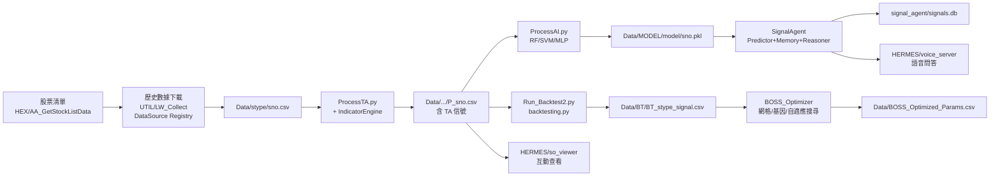
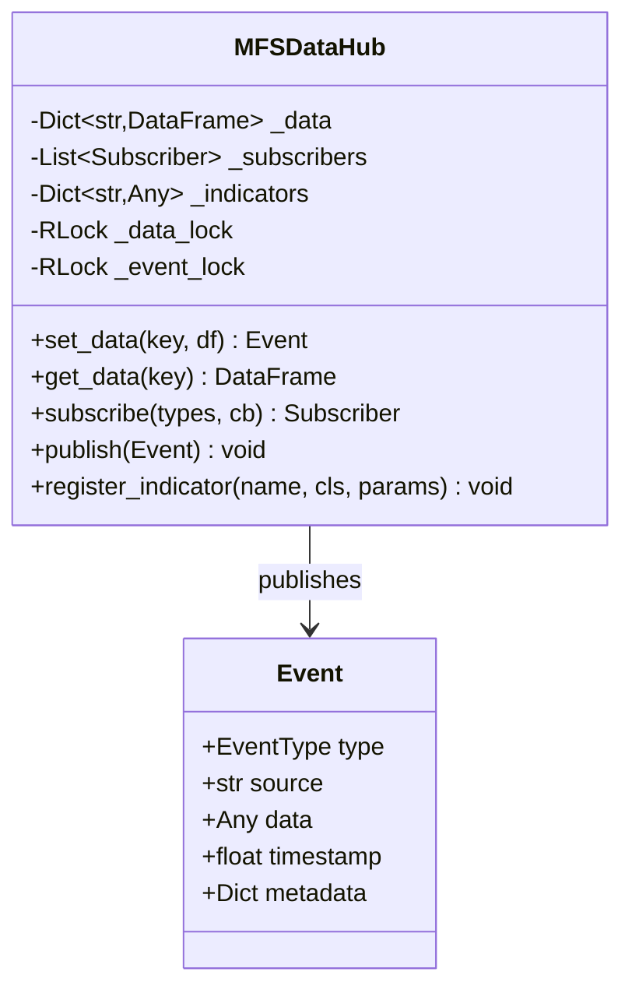
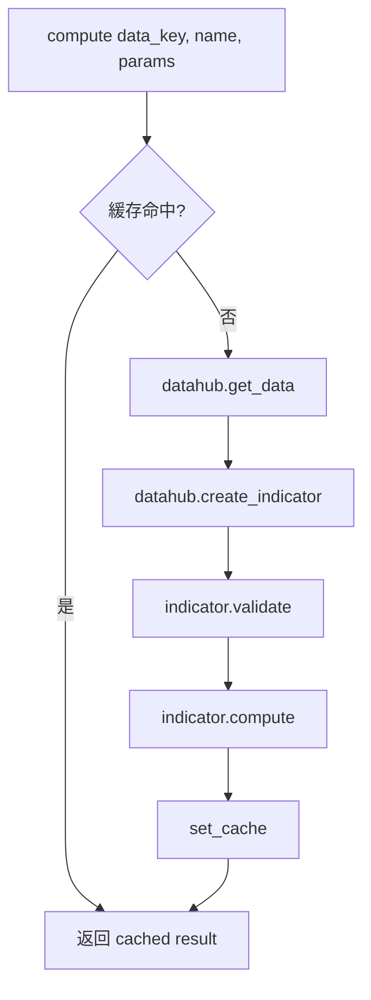
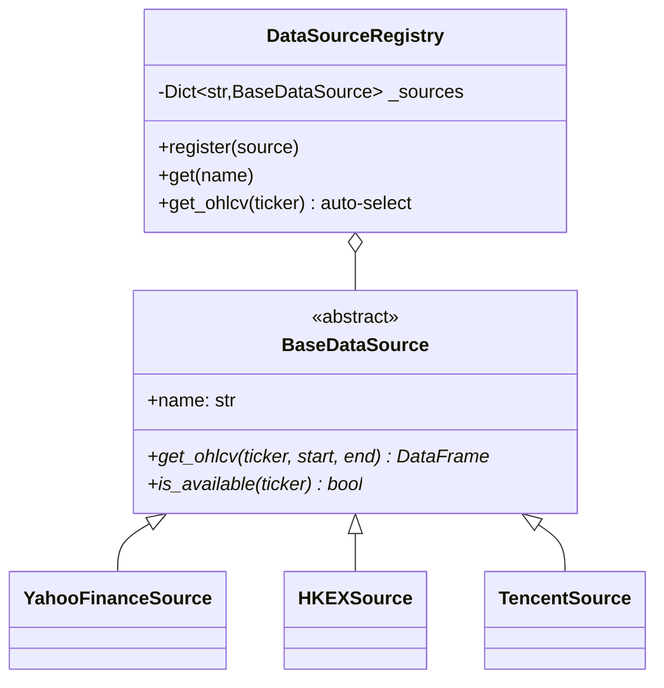
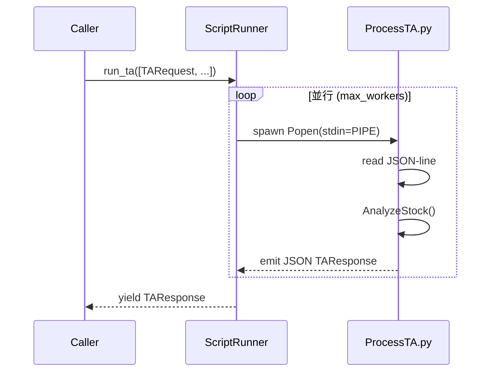
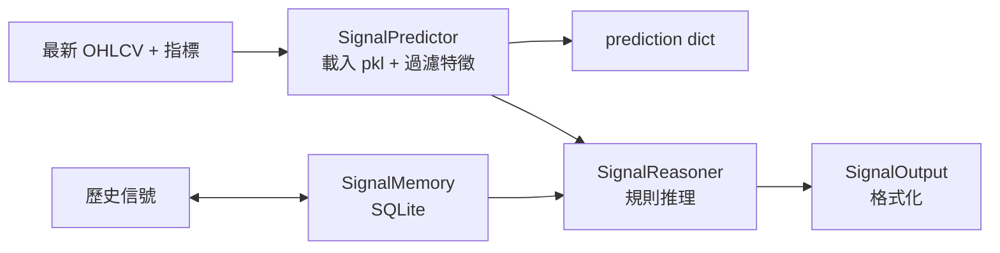
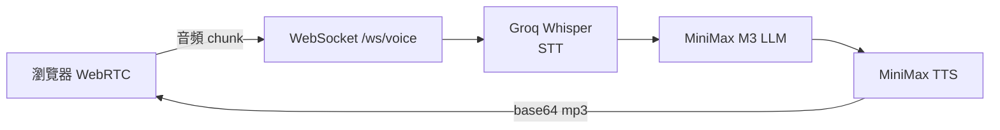

# MFS 架構文件

> 適用版本：commit `fc154ff`（2026-06-02）  
> 受眾：人類開發者 + 技術寫作者

---

## 目錄

1. [概述](#1-概述)
2. [目錄結構](#2-目錄結構)
3. [資料流](#3-資料流)
4. [核心模組詳解（新版）](#4-核心模組詳解新版)
5. [技術指標（傳統 TA）](#5-技術指標傳統-ta)
6. [AI 模型](#6-ai-模型)
7. [回測引擎](#7-回測引擎)
8. [HERMES 應用層](#8-hermes-應用層)
9. [配置常數](#9-配置常數)
10. [Git 工作流](#10-git-工作流)
11. [已知問題](#11-已知問題)
12. [術語表](#12-術語表)

---

## 1. 概述

**MFS（Multi-Factor Stock Screener）** 是一個香港股票的量化交易研究系統，主要做三件事：

1. **篩選**：用技術指標（BOSS / VCP / Ichimoku / HFH 等）與機器學習模型（RF / SVM / MLP）對 ~2000 檔港股做信號偵測
2. **驗證**：用 `backtesting.py` 對歷史資料做回測，計算 Sharpe / Sortino / Calmar / SQN / 最大回撤等指標
3. **展示**：透過 `HERMES/` 下的多套 Web 工具（語音助手、期權查看器、掃描器）做視覺化與互動

整體定位是**研究系統**而非即時交易系統，所有決策都基於歷史回測與技術分析。

### 1.1 技術棧

- **語言**：Python 3.11+
- **核心計算**：pandas, numpy, scikit-learn, XGBoost, LightGBM
- **回測**：[backtesting.py](https://kernc.github.io/backtesting.py/)
- **資料源**：yfinance（主力）、HKEX 官方、騰訊財經
- **Web**：Flask（so_viewer）、WebSocket + WebRTC（voice_server）
- **語音**：Groq Whisper（STT）、MiniMax（M3 LLM + TTS）
- **並發**：`ProcessPoolExecutor`（Linux/Win）/ `ThreadPoolExecutor`（macOS）
- **持久化**：SQLite（SignalAgent signals.db）

---

## 2. 目錄結構

```
MFS/
├── Core/                  # 🆕 統一架構核心
│   ├── MFSDataHub.py      #    單例數據中心 + 事件總線
│   ├── IndicatorEngine.py #    指標依賴解析 + 緩存
│   └── indicators/        #    7 個 BaseIndicator 實現
│
├── DataSource/            # 🆕 數據源插件系統
│   ├── base.py            #    BaseDataSource 抽象
│   ├── registry.py        #    DataSourceRegistry 單例
│   ├── yahoo_finance.py   #    Yahoo Finance 適配
│   ├── hkex.py            #    HKEX 適配
│   └── tencent.py         #    騰訊財經適配
│
├── ScriptRunner/          # 🆕 Subprocess + JSON-line 調度
│   ├── protocol.py        #    請求/響應 dataclass
│   └── runner.py          #    ScriptRunner / ScriptRunnerSimple
│
├── SignalAgent/           # 🆕 AI 信號代理（SQLite）
│   ├── memory.py          #    歷史信號記憶
│   ├── predictor.py       #    模型推理
│   ├── reasoner.py        #    多指標規則推理
│   └── output.py          #    輸出格式化
│
├── TA/                    # 18 個技術指標模組
│   ├── LW_CheckBoss.py    #    BOSS 波段策略
│   ├── LW_CheckIchimoku.py
│   ├── LW_CheckHFH.py     #    High-Flat-High
│   ├── LW_CheckVCP.py     #    Volatility Contraction Pattern
│   ├── LW_CheckFisher.py
│   ├── LW_CheckBreakout200.py
│   ├── LW_CheckGBS22C.py
│   ├── LW_CheckWave.py    #    HHHL 波浪
│   ├── LW_CalHHLL.py      #    高低點計算
│   ├── LW_Calindicator.py
│   └── *_bk.py            #    ⚠️ 備份（不要刪）
│
├── AI/                    # 8 個 ML 模型
│   ├── RandomForest.py
│   ├── SVM.py
│   ├── MLP.py
│   ├── LogisticRegression.py
│   ├── DecisionTree.py
│   ├── XGBoost.py
│   ├── LightGBM.py
│   └── ZPrediction.py
│
├── HEX/                   # 港股數據抓取
│   ├── AA_GetStockListData.py  # AAStocks 抓清單
│   ├── AA_GetIndustryList.py
│   ├── AA_filterStock.py
│   ├── CCASS_GetAll.py / CCASS_GetDelta.py
│   ├── StockPrice.py / StockOption.py
│   ├── IndexFuture.py / IndexOption.py
│   └── SOList.py / TushareData.py
│
├── HERMES/                # 應用層
│   ├── voice_server.py    #    語音助手（WS + STT + LLM + TTS）
│   ├── so_viewer/         #    Flask 期權查看器
│   │   ├── app.py
│   │   └── templates/index.html
│   ├── merge_monthly.py   #    HKEX 日檔→月度合併
│   ├── hk_rebound_picks.py
│   ├── hk_stock_gann_scanner.py
│   ├── scrape_tv_stocks.py
│   ├── get_tradingview_*.py
│   ├── Pine/              #    TradingView Pine 腳本
│   ├── Plans/             #    策略規劃 MD
│   └── Skill/             #    Ichimoku 組合技能
│
├── LLM/                   # LLM 工具腳本
├── TIM/                   # TIM 系統（登入 + Excel 結果）
├── ROO/                   # ⚠️ 大量 debug / test 暫存
├── UTIL/
│   ├── CommonConfig.py    # ⚠️ 全域配置（import * 注入 20+ 符號）
│   ├── LW_Collect.py      #    YF 數據抓取（多進程）
│   └── LW_FilterStock.py  #    信號篩選
│
├── ProcessTA.py           # 單股票 TA 處理（--json-stdin）
├── ProcessAI.py           # 單股票 AI 處理
├── Run_Full.py            # 一次性全量 pipeline
├── Run_Daily.py           # 每日增量
├── Run_Backtest2.py       # 主回測
├── BOSS_Optimizer.py      # BOSS 參數優化
├── AI_Backtest.py / AI_VCP.py
│
├── Data/                  # 數據與結果（大部分 gitignore）
├── backtest.log           # 回測日誌（13MB）
├── .kilo/plans/           # Kilo 計畫
├── .continue/             # Continue.dev 設定
├── AGENTS.md              # AI agent 工作守則
├── Architecture.md        # 本檔
└── REQUIREMENTS_ANALYSIS.md
```

---

## 3. 資料流



### 3.1 兩條主要路徑

| 路徑 | 用途 | 觸發點 |
|------|------|--------|
| **生產路徑** | `PATH/OUTPATH`（相對路徑 `../SData/...`） | `Run_Daily.py`, `ProcessTA.py`, `ProcessAI.py` |
| **全量路徑** | `FPATH/FOUTPATH`（Linux 絕對路徑） | `Run_Full.py` 暫時切換 |

---

## 4. 核心模組詳解（新版）

### 4.1 `Core/MFSDataHub.py` — 數據中心 + 事件總線



**特性**：
- 單例（threading.Lock 保護雙重檢查）
- 5 種事件：`DATA_UPDATED`, `INDICATOR_REGISTERED`, `INDICATOR_COMPUTED`, `MARKET_ALERT`, `CUSTOM`
- 訂閱支援 `source_filter` 與 `once=True`
- 向後兼容 `set_ohlcv(symbol, tf, df)` / `get_ohlcv(symbol, tf)`

### 4.2 `Core/IndicatorEngine.py` — 指標執行引擎



**特性**：
- 自動拓撲排序（Kahn 算法）解析指標依賴
- 緩存 key = `(data_key, indicator_name, params_hash)`，TTL 300s
- 多周期合併：`compute_multi_timeframe()`
- 向後兼容：`run_indicator()` / `add_indicator()` 接受舊呼叫風格

**已註冊 7 個 Wrapper**：

| Wrapper | 對應 TA 模組 |
|---------|------------|
| `IchimokuWrapper` | `TA/LW_CheckIchimoku.py` |
| `HFHWrapper` | `TA/LW_CheckHFH.py` |
| `BossWrapper` | `TA/LW_CheckBoss.py` |
| `VCPWrapper` | `TA/LW_CheckVCP.py` |
| `FisherWrapper` | `TA/LW_CheckFisher.py` |
| `GBS22CWrapper` | `TA/LW_CheckGBS22C.py` |
| `Breakout200Wrapper` | `TA/LW_CheckBreakout200.py` |

### 4.3 `DataSource/` — 數據源插件



**用法**：
```python
from DataSource import get_ohlcv
df = get_ohlcv("0700.HK", start="2024-01-01")
```

### 4.4 `ScriptRunner/` — Subprocess 調度



**協議**（`ScriptRunner/protocol.py`）：
- `TARequest`: `{sno, stype, tdate, ai}`
- `AIRequest`: `{sno, stype, tdate, model}`
- `TAResponse`: `{sno, stype, success, signal, error}`
- `AIResponse`: `{sno, stype, model, success, prediction, probability}`

### 4.5 `SignalAgent/` — AI 信號代理



**SQLite Schema**：
```sql
CREATE TABLE signals (
    id INTEGER PRIMARY KEY AUTOINCREMENT,
    ticker TEXT NOT NULL,
    model TEXT NOT NULL,
    signal INTEGER NOT NULL,
    confidence REAL,
    indicators TEXT,  -- JSON
    date TEXT NOT NULL,
    created_at TIMESTAMP DEFAULT CURRENT_TIMESTAMP
);
CREATE INDEX idx_ticker_date ON signals(ticker, date DESC);
CREATE INDEX idx_model ON signals(model);
```

**DROP_COLS**（預測時過濾的欄位）：
```
sno, F10D, F20D, F30D, classification,
BOSS_PATTERN, BOSS_STATUS, HHHL_PATTERN,
LLDate, HHDate, WLDate, WHDate,
ICHIMOKU_SIGNAL/STRENGTH, GBS22C_SIGNAL/STRENGTH,
BREAKOUT200_SIGNAL/STRENGTH, FISHER_SIGNAL/STRENGTH
```

---

## 5. 技術指標（傳統 TA）

### 5.1 BOSS 策略（`LW_CheckBoss.py`）

BOSS 是最核心的策略，採用 22/33 日滾動低點 + 150 日 MA 識別波段，輸出進場價、TP1/2/3、CL 止損位。

**關鍵參數**（`BOSSParams`）：

| 參數 | 預設 | 說明 |
|------|------|------|
| `WINDOW_22D_LOW` | 22 | 22 日滾動低點窗口 |
| `WINDOW_33D_LOW` | 33 | 33 日滾動低點窗口 |
| `MA_PERIOD` | 150 | 長期趨勢均線 |
| `VOLATILITY_THRESHOLD` | 0.14 | 波動率門檻 |
| `BOSS1_PATTERNS` | LHLLHH, HHLLHH | 認定的波段型態 |
| `BULLISH_RATIO_THRESHOLD` | 0.65 | 漲勢比率門檻 |
| `TP1/TP2/TP3_THRESHOLD` | 0.995/0.99/0.99 | 觸發門檻 |
| `BUY_DEADLINE` | 22 | 進場截止天數 |
| `TP_DEADLINE` | 30 | TP/CL 追蹤期限 |

**狀態機**（簡化）：
```
[盤整偵測] → 22日低 + 33日低 + 150日MA → [BOSS1: 型態認定]
  → 突破 → [BOSS2: 漲勢確認] → 進場 (記錄 cl_price / tp2_price)
  → TP1 (1%) / TP2 / TP3 / CL 止損
  → TU1 / TU2 趨勢跟蹤
```

### 5.2 一目均衡表（Ichimoku）

**用戶偏好參數**：Tenkan=**34**, Kijun=**5**, SenkouB=**52**, CloudPeriod=**26**  
**MA 濾網**：49 日線 vs 233 日線  
**綜合訊號**：MACD(40%) + RSI(30%) + MA(30%)，範圍 -1.0 ~ +1.0

| 區間 | 標籤 |
|------|------|
| +0.5 ~ +1.0 | 強烈買入 |
| +0.1 ~ +0.5 | 輕微偏好 |
| -0.1 ~ +0.1 | 中立觀望 |
| -0.5 ~ -0.1 | 輕微偏淡 |
| -1.0 ~ -0.5 | 強烈賣出 |

### 5.3 HFH（High-Flat-High）

偵測「高位平台突破」型態。**爭議最多**，`ROO/HFH_*.py` 有 ~18 個 debug 腳本。已規劃 `HERMES/Plans/HFH_Optimization_Plan.md`。

### 5.4 VCP（Volatility Contraction Pattern）

波動收縮 + 突破，結果輸出至 `Data/allvcp.xlsx`。

### 5.5 其他指標

- **HHHL**（`LW_CheckWave.py`）：波浪理論
- **Fisher**（`LW_CheckFisher.py`）：Fisher 轉換
- **GBS22C**：22 日週期
- **Breakout200**：突破 200 日均線
- **T1**（`LW_CheckT1.py`）：簡單 Type 1 信號

---

## 6. AI 模型

### 6.1 訓練設定

所有模型共用：
- **特徵**：`ProcessTA.py` 輸出之所有數值欄位（過濾 `DROP_COLS`）
- **標籤**：`F20D > 0.15`（20 日後漲幅 > 15%）
- **訓練/測試比例**：80/20，`stratify=y`
- **缺失值**：`SimpleImputer(strategy='mean')`
- **模型存檔**：`Data/MODEL/{MODEL}/{sno}.pkl`（若 `PROD=True`）

### 6.2 模型清單

| 模型 | 類別 | 備註 |
|------|------|------|
| RandomForest | `n_estimators=100, max_depth=10, class_weight=balanced` | 有 `feature_importances_` |
| SVM | sklearn SVC | 速度慢，僅中小型資料集可行 |
| MLP | sklearn MLPClassifier | 隱藏層預設 |
| LogisticRegression | sklearn LR | 線性基準 |
| DecisionTree | sklearn DT | 易過擬合 |
| XGBoost | xgboost 介接 | 梯度提升 |
| LightGBM | lightgbm 介接 | 快速梯度提升 |
| ZPrediction | Z-Score 預測 | 框架型 |

### 6.3 勝率參考（舊紀錄，僅供參考）

| 模型 | 總交易次數 | 平均勝率 |
|------|-----------|---------|
| MLP | 257 | 69.38% |
| SVM | 102 | 67.74% |
| RF | 21 | 66.36% |
| LR | 2,422 | 64.28% |
| DT | 3,109 | 57.42% |

---

## 7. 回測引擎

### 7.1 `Run_Backtest2.py` 主回測

使用 [`backtesting.py`](https://kernc.github.io/backtesting.py/)，`ModernStrategy` 實作：

| 參數 | 預設 | 說明 |
|------|------|------|
| `cash` | 200,000 | 起始資金 |
| `commission` | 0.002 | 手續費 0.2% |
| `margin` | 1.0 | 無槓桿 |
| `trade_on_close` | False | 次日開盤成交 |
| `exclusive_orders` | True | 同時只一單 |

**平倉優先級**：
1. `max_holdbars`（時間止損）
2. **BOSSB 特殊**：`cl_price` / `tp2_price` 固定價位
3. `dd`（追蹤止損 — 從最高點回撤 dd%）
4. 否則讓 `backtesting` 內建 `sl` / `tp` 處理

**輸出**：`{returns, sno, final, peak, trades_counts, win_rates, RR, SQN, sharpe_ratios, sortino_ratios, calmar_ratios, max_drawdowns, ann_return, volatility, ...}`

### 7.2 回測變體

| 檔案 | 特色 |
|------|------|
| `Run_Backtest.py` | 原始版 |
| `Run_Backtest2.py` | 當前主用 |
| `Run_Backtest_Combined.py` | 多策略組合 |
| `Run_Backtest_FisherIchimoku.py` | Fisher+Ichimoku 組合 |
| `Run_BacktestBK.py` / `_bk.py` | 備份 |

### 7.3 參數優化

`BOSS_Optimizer.py` 支援三種模式：
- `--mode grid --rounds 100`
- `--mode genetic --generations 50`
- `--mode adaptive --rounds 200`

輸出：`Data/BOSS_Optimized_Params_*.csv` + checkpoint `.pkl`

---

## 8. HERMES 應用層

### 8.1 語音助手（`voice_server.py`）



**端點**：

| 端點 | 方法 | 用途 |
|------|------|------|
| `/` | GET | 語音聊天頁面 |
| `/ws/voice` | WS | 語音 WebSocket |
| `/health` | GET | 健康檢查 |
| `/test/stt` | GET | 測試 STT |
| `/test/llm` | POST | 測試 LLM |
| `/test/tts` | POST | 測試 TTS |

**環境變數**：
```bash
export MINIMAX_CN_API_KEY="sk-cp-xxxxx"
export GROQ_API_KEY="sk_xxxx"
```

### 8.2 期權查看器（`so_viewer/`）

Flask 應用，908 行 Python + 44KB HTML，**目前最活躍的開發區**。

- **SO**（股票期權，純數字代碼如 `00700`）— `/root/GitHub/SData/HKEX/SO`
- **IO**（指數期權，純字母如 `HSI`）— `/root/GitHub/SData/HKEX/IO`
- **月度合併檔**（`SO_M/`, `IO_M/`）— 加速 scan，從讀取萬次降至百次

**Tab 功能**：
- Tab1：OI 表格
- Tab2：IF（指數期貨）篩選
- Tab3：跨產品淨數變化掃描（最新：預設本月 ~ 12月，含 C/P 比率、Top3 紅色 highlight）

### 8.3 港股掃描器

- `hk_rebound_picks.py` — 反彈型態
- `hk_stock_gann_scanner.py` — 江恩方陣
- `get_tradingview_*.py` + `scrape_tv_stocks.py` — TradingView 行業/股票爬蟲

### 8.4 Pine 腳本

- `HERMES/Pine/hk_sector_heatmap_v2.pine`
- `HERMES/Pine/hk_sector_heatmap_v3.pine`
- `HERMES/Skill/ichimoku_combinations.pine`

### 8.5 Skills 系統

- `HERMES/Skill/SKILL.md` — stock-technical-analysis 工作流（H 老師人格）
- `HERMES/skills/devops/cloudflare-tunnel/SKILL.md` — Cloudflare tunnel
- `HERMES/Plans/` — 策略規劃 MD

---

## 9. 配置常數

`UTIL/CommonConfig.py` 集中管理：

```python
# 路徑
PATH    = "../SData/YFData/"         # 原始 OHLCV
OUTPATH = "../SData/P_YFData/"       # 加指標後
FPATH   = "/root/GitHub/SData/FYFData/"   # Full 版
FOUTPATH= "/root/GitHub/SData/FP_YFData/" # Full 版輸出

# 平台
IFPATH = "/root/GitHub/SData/HKEX/IF/"
IOPATH = "/root/GitHub/SData/HKEX/IO/"
SOPATH = "/root/GitHub/SData/HKEX/SO/"

# 業務
DATADATE = "2024-01-01"
PROD     = True

# 信號
TALIST    = ["BOSSB","HHHL","VCP","HFH","ICHIMOKU"]
MODELLIST = ["SVM","MLP","RF"]

# 市場過濾
HSI_TREND_FILTER = True  # EMA20

# 並發
IS_WINDOWS = platform.system() == "Windows"
IS_IOS     = platform.system() == "Darwin"
DEFAULT_MAX_WORKERS = 5 if IS_IOS else (os.cpu_count() or 4)
ExecutorType = ThreadPoolExecutor if IS_IOS else ProcessPoolExecutor
```

> ⚠️ `from TA.LW_CheckBoss import *` 等 12 個 `import *` 會把 20+ 個 TA/AI 函數全域注入，啟動成本高且易撞名。新人改指標時若看到 `NameError: name 'xxx' is not defined`，第一個檢查 `CommonConfig.py`。

---

## 10. Git 工作流

### 10.1 提交風格

`<emoji> <scope>: <一句話描述>`

```
🔧 改進/重構     🐛 Bug 修復     🌐 國際化/i18n
🌟 新功能       ⚡ 性能優化      📝 文檔         🧪 測試
```

範例：
- `🔧 Tab3: 預設值改為本月第一日 + 本月 ~ 12月`
- `🐛 merge_monthly: 修復去重 bug（同一 strike 配不同 settle_price 係唔同合約，必須保留）`

### 10.2 .gitignore 摘要

```gitignore
# Python
__pycache__/ *.py[cod]

# 虛擬環境
.venv/ venv/

# 數據
Data/*.csv Data/*.xlsx Data/*.pkl Data/*.png

# 密鑰
LLM/ApiKey.md

# 大型原始
Sdata/
backtest.log   # ⚠️ 沒被 ignore，13MB
```

> 建議把 `backtest.log` 加入 `.gitignore`，並設置 log rotate。

### 10.3 最近 20 個 commit 趨勢

集中在三個區域：
1. `HERMES/so_viewer/` — Tab3 UI 持續打磨
2. `HERMES/merge_monthly.py` — 月度合併 + 去重 bug
3. `HERMES/so_viewer/app.py` — 性能優化

---

## 11. 已知問題

| 編號 | 嚴重度 | 問題 | 建議 |
|------|--------|------|------|
| 1 | 高 | `CommonConfig.py` `import *` 注入 20+ 符號 | 改為顯式 `import` 或 `__all__` |
| 2 | 高 | `ProcessTA.py` 對 `IchimokuWrapper` 用 `try/except` fallback 雙路徑 | 統一到 `IndicatorEngine` |
| 3 | 中 | `HERMES/so_viewer/app.py` 寫死 Linux 路徑 | Windows 端需先評估遷移策略 |
| 4 | 中 | `TA/` 存在 `*_bk.py` 備份 | 改由 git history 管理 |
| 5 | 中 | `ROO/` 是 debug 暫存區 | 整理或移至 `tests/` |
| 6 | 中 | `backtest.log` 無 rotate，已 13MB | 加 `.gitignore` + 設 rotating handler |
| 7 | 中 | 完全沒有 pytest / CI | 至少加 `tests/test_smoke.py` 驗證 import |
| 8 | 低 | `LW_FilterStock.py` `EDATE` 硬編碼 | CLI 參數化 |
| 9 | 低 | `Data/*.csv|pkl` 已在 gitignore，但 `Data/Result/` 仍存在 | 統一規範 |
| 10 | 低 | HERMES Skill / Continue 設定混雜 | 釐清邊界 |

---

## 12. 術語表

| 術語 | 說明 |
|------|------|
| **BOSS** | Buy On Strong Swing — 自研波段策略 |
| **VCP** | Volatility Contraction Pattern — 波動收縮型態 |
| **HFH** | High-Flat-High — 高位平台突破型態 |
| **HHHL** | High-High / High-Low — 波浪理論高低點 |
| **ICHIMOKU** | 一目均衡表（34, 5, 52, 26 參數） |
| **stype** | Stock type: L = Long（長期）/ M = Medium（中期） |
| **Sno** | Stock number 股票編號 |
| **DATADATE** | 訓練資料截止日 |
| **PROD** | 是否寫模型到磁碟 |
| **M3** | MiniMax-M3 大語言模型（本對話使用） |
| **so_viewer** | Stock Options viewer — 港股期權查看器 |
| **HERMES** | 整個應用層代號（希臘神話信使之神） |
| **小模型** | `small_model`，用於生成標題/摘要等小任務 |
| **EM file** | 期望最大化（Expectation-Maximization）演算法，本專案未使用 |

---

> 文件版本：v1.0  
> 維護者：PatchQ  
> 問題回報：https://github.com/PatchQ/MFS/issues
