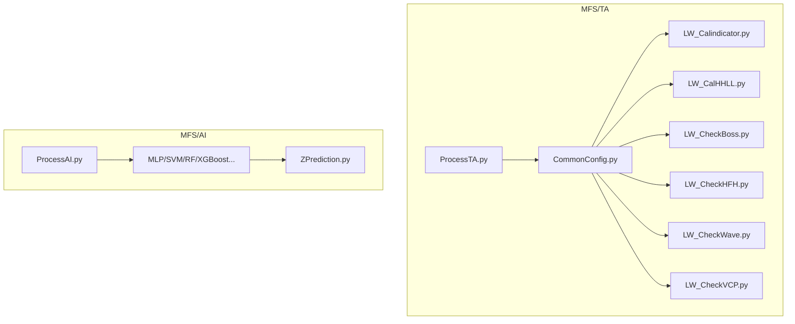
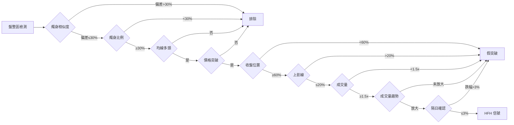

# BOSSB & HFH 信號過少原因分析與建議

## 1. 專案架構概述



### 關鍵流程 (ProcessTA.py)
```
載入股票數據 → extendData/convertData → calEMA → calHFH → calHHLL → checkBoss → checkWave → checkVCP → 輸出
```

---

## 2. 信號產生流程分析

### 2.1 BOSSB 信號產生條件

**BOSS 策略分為兩階段:**

#### BOSS1 條件 (基本篩選):
1. **型態過濾**: `BOSS_PATTERN` 需為 `["LHLLHH", "HHLLHH"]`
2. **HHClose > High**: 最高中收市價高於LH日的最高位
3. **波動率門檻**: `VOLATILITY >= 0.14` (14%)
4. **趨勢保護**: 價格需大於 MA150 (目前在程式碼中被註解掉)

#### BOSS2 條件 (進階篩選):
1. `LLLow <= 22DLow` (低點需低於22日低點)
2. `bullish_ratio >= 0.65` (漲勢比率)
3. `strong_bullish >= 1` (強陽燭數量)
4. `bullish_count >= 4` (總陽燭數量)

**BOSSB 產生**: 必須滿足 BOSS2 條件，並在進場截止日前價格觸及進場價

### 2.2 HFH 信號產生條件

**三階段策略:**

1. **Pre-High (強勢上升段)**:
   - 需要連續 `min_strong_bullish=3` 支強陽燭
   - 每支陽燭燭身/燭桿比例需 > 50%
   - 收盤價需遞增 (consecutive_higher=True)

2. **Flat Zone (盤整區)**:
   - 盤整長度 >= 5 支蠟燭
   - High-Low 範圍 <= 10% (或 ATR 動態調整)
   - 燭身大小偏差 <= 30%
   - 燭身/燭桿比例 >= 30%

3. **Breakout (突破)**:
   - 收盤位置 >= 60% (相對燭桿)
   - 上影線 <= 20%
   - 成交量 >= 均量 1.5 倍
   - 成交量趨勢放大
   - 隔日確認 (最大跌幅 3%)

---

## 3. 信號過少的主要原因

### 3.1 BOSSB 信號過少的原因

| 原因 | 說明 | 影響程度 |
|------|------|----------|
| **多層過濾機制** | BOSS1 → BOSS2 → 進場模擬 → BOSSB，層層過濾 | 🔴 高 |
| **嚴格的 K 線條件** | bullish_ratio >= 0.65, strong_bullish >= 1, bullish_count >= 4 | 🔴 高 |
| **進場截止日限制** | BUY_DEADLINE=22日，超過後信號失效 | 🟡 中 |
| **EMA3 條件** | 進場需要 `EMA3 == True` (EMA22>EMA50>EMA100>EMA250) | 🟡 中 |
| **波動率門檻** | VOLATILITY >= 14% 可能排除很多股票 | 🟡 中 |
| **均線多頭排列被註解** | Trend_Filter 雖然寫了但被註解掉 | 🟢 低 |

### 3.2 HFH 信號過少的原因

| 原因 | 說明 | 影響程度 |
|------|------|----------|
| **極嚴格的強陽燭要求** | 需連續 3 支，body_ratio > 50%，收盤遞增 | 🔴 高 |
| **連續遞增限制** | `require_consecutive_higher=True` 非常嚴格 | 🔴 高 |
| **盤整區嚴格檢測** | 燭身相似度、燭身比例等額外條件 | 🔴 高 |
| **成交量要求提高** | 從 1.2x 提高到 1.5x | 🟡 中 |
| **隔日確認機制** | next_day_confirm=True 可能排除很多 valid 信號 | 🟡 中 |
| **ATR 動態調整** | 對於波動小的股票反而可能收緊盤整區間 | 🟡 中 |

---

## 4. 詳細原因分析

### 4.1 BOSSB: 為何信號極少

```
BOSS1 通過率: ~5-10% (猜測)
BOSS2 通過率: ~30-40% (基於 BOSS1)
實際進場觸發: ~20-30% (基於 BOSS2)
最終 BOSSB 信號: ~0.3-1.2% 的交易日
```

**核心問題:**
1. **LHLLHH/HHLLHH 型態稀有**: 需要連續特定的波段結構
2. **波段認定依賴 HHLL 演算法**: 如果 HHLL 識別的點位少，信號自然少
3. **22日滾動低點**: `LLLow <= 22DLow` 可能排除很多情況
4. **買入價計算**: `(HHHigh + LLLow) / 2` 如果股價波動大，很難觸及

### 4.2 HFH: 為何信號極少

```
強陽燭序列通過率: ~10-15%
盤整區通過率: ~40-50% (基於強陽燭序列)
突破日通過率: ~30-40% (基於盤整區)
隔日確認通過率: ~60-70% (基於突破日)
最終 HFH 信號: ~0.1-0.5% 的交易日
```

**核心問題:**
1. **三個階段全部滿足很難**: 需要 Pre-High + Flat + Breakout 全部符合
2. **連續強陽燭要求嚴格**: 需要連續遞增收盤價，很難滿足
3. **盤整區間狹窄**: max_flat_pct=10% 加上 ATR 動態調整，有時反而更嚴格
4. **成交量放大 1.5 倍**: 不是所有突破都有量

---

## 5. 參數調整建議

### 5.1 BOSSB 參數調整

| 參數 | 當前值 | 建議值 | 理由 |
|------|--------|--------|------|
| `BULLISH_RATIO_THRESHOLD` | 0.65 | 0.55~0.60 | 稍微放寬漲勢比率要求 |
| `BULLISH_COUNT_MIN` | 4 | 3 | 減少最少陽燭數量 |
| `BUY_DEADLINE` | 22 | 30~44 | 延長進場截止時間 |
| `VOLATILITY_THRESHOLD` | 0.14 | 0.10~0.12 | 降低波動率門檻 |

**建議启用趋势过滤 (取消註解)**:
```python
# Line 149 in LW_CheckBoss.py
df['BOSS1'] = BOSS1Rule1 & BOSS1Rule2 & BOSS1Rule3 & Trend_Filter  # 建議開啟
```

### 5.2 HFH 參數調整

| 參數 | 當前值 | 建議值 | 理由 |
|------|--------|--------|------|
| `min_strong_bullish` | 3 | 2 | 減少需要的連續強陽燭數 |
| `require_consecutive_higher` | True | False | 移除收盤遞增要求 |
| `min_flat_length` | 5 | 4 | 減少盤整最少燭數 |
| `max_flat_pct` | 0.10 | 0.12~0.15 | 放寬盤整區間 |
| `min_volume_ratio` | 1.5 | 1.2~1.3 | 降低成交量要求 |
| `next_day_max_drop` | 0.03 | 0.04~0.05 | 放寬隔日確認容許跌幅 |

---

## 6. 架構改進建議

### 6.1 HFH 減少條件衝突

**問題**: `LW_CheckHFH.py` 中多個條件可能相互衝突，導致幾乎沒有信號



### 6.2 建議的分階段參數調整

**Phase 1: 最小改動測試**
```python
# LW_CheckHFH.py - 只改動關鍵參數
min_strong_bullish = 2  # 從 3 改為 2
require_consecutive_higher = False  # 從 True 改為 False
```

**Phase 2: 中等改動**
```python
min_flat_length = 4  # 從 5 改為 4
max_flat_pct = 0.12  # 從 0.10 改為 0.12
min_volume_ratio = 1.3  # 從 1.5 改為 1.3
```

**Phase 3: 全面放寬 (如果需要更多信號)**
```python
next_day_confirm = False  # 移除隔日確認
```

---

## 7. 驗證方法

### 7.1 診斷腳本建議

創建診斷腳本分析不通過的原因:

```python
# TEMP/HFH_Diagnosis.py
def diagnose_hfh_filters(df, sno):
    """分析 HFH 各階段不通過的原因"""
    results = {
        'total_candles': len(df),
        'strong_bullish_count': 0,
        'strong_bullish_passes_consecutive': 0,
        'flat_zone_candidates': 0,
        'breakout_candidates': 0,
        'failed_at_volume': 0,
        'failed_at_next_day': 0,
        'final_hfh': 0
    }
    # ... 統計各階段通過/不通過數量
    return results
```

### 7.2 回測驗證

```bash
# 建議先在少量股票上進行回測
python Run_Backtest.py --stocks=0700,9988,0005 --strategies=BOSSB,HFH
```

---

## 8. 總結與建議行動

### 立即行動:
1. **診斷現有問題**: 在 `TEMP/` 目錄下創建診斷腳本，統計各階段過濾率
2. **Phase 1 參數調整**: 先調整 `min_strong_bullish=2` 和 `require_consecutive_higher=False`
3. **驗證信號品質**: 確保調整後的信號質量不會大幅下降

### 中期行動:
1. **建立監控機制**: 追蹤每天的信號數量和質量
2. **參數優化**: 使用網格搜索或貝葉斯優化找到最佳參數組合
3. **市場適配**: 不同市場環境可能需要不同參數

### 關鍵洞察:
- HFH 和 BOSSB 設計都非常嚴格，這是故意的 (減少假信號)
- 但如果信號太少，可能是**過度優化**的信號
- 建議先放寬參數獲得更多信號，再通過**勝率**和**盈虧比**來過濾