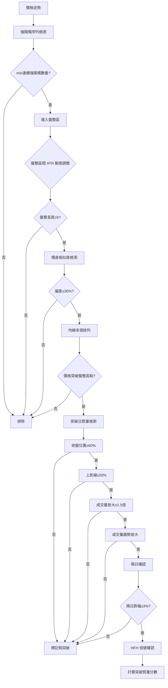

# TA/LW_CheckHFH.py 策略分析

## 策略概述
High-Flat-High (HFH) 策略是一個短線突破策略，核心邏輯：
1. **第一階段 (Pre-High)**: 盤整前需要連續強陽燭確認上升動能
2. **第二階段 (Flat)**: 價格在一定範圍內橫向整理
3. **第三階段 (Breakout)**: 價格突破盤整高點並滿足多項質量條件

---

## 已實施的改進

### 1. 提高成交量倍數
- `min_volume_ratio`: 1.2 → **1.5**
- 原因：更嚴格的成交量確認，減少假突破

### 2. 新增動態盤整區間 (ATR-based)
- 新增參數：
  - `use_dynamic_flat_pct=True`: 啟用動態調整
  - `atr_period=14`: ATR 計算週期
  - `atr_flat_multiplier=1.5`: ATR 倍數
- 邏輯：根據股票的歷史波動率自動調整盤整區間範圍
- 優點：高低價股適用不同標準

### 3. 新增成交量趨勢檢測
- 突破前成交量應逐步放大
- 取前3天成交量與前期均量比較
- 避免成交量突然放大但無持續性的假信號

### 4. 修復索引邊界問題
- `pre_high_count[prev_start]` 現在會檢查 `prev_start` 是否在有效範圍 `[1, n-1]` 內

---

## 參數評估

| 參數 | 預設值 | 評估 | 建議 |
|------|--------|------|------|
| `min_strong_bullish` | 3 | 合理 | 可根據市場調整 |
| `body_ratio` | 0.5 | 合理 | 50% 燭身比例標準適中 |
| `require_consecutive_higher` | True | **偏嚴格** | 可能排除 valid 信號 |
| `min_flat_length` | 5 | 合理 | 短期盤整標準 |
| `max_flat_pct` | 0.10 | 配合 ATR 使用 | 動態調整更精確 |
| `max_body_deviation` | 0.30 | 合理 | 30% 偏差允許適度變異 |
| `min_flat_body_ratio` | 0.30 | 合理 | 避免十字星 |
| `min_close_strength` | 0.6 | 合理 | 要求收在燭體上半部 |
| `max_upper_wick` | 0.2 | 合理 | 20% 上影線限制可接受 |
| `min_volume_ratio` | **1.5** | **已提高** | 更嚴格的成交量標準 |
| `next_day_confirm` | True | 很好 | 防假突破機制 |
| `next_day_max_drop` | 0.03 | 合理 | 3% 容許範圍適中 |

---

## 策略架構圖

---

## 總體評估

| 維度 | 評分 | 說明 |
|------|------|------|
| 策略邏輯 | ⭐⭐⭐⭐ | 三階段結構清晰合理 |
| 風險控制 | ⭐⭐⭐⭐⭐ | 隔日確認 + 假突破標記 + 成交量趨勢非常實用 |
| 參數設定 | ⭐⭐⭐⭐ | 大部分合理，ATR 動態調整是重要改進 |
| 程式品質 | ⭐⭐⭐⭐ | 註解詳細，結構良好 |
| **整體** | **⭐⭐⭐⭐** | **一個、生產級別的短線突破策略** |

---

## 結論

`TA/LW_CheckHFH.py` 已根據分析建議完成修改：

1. ✅ `min_volume_ratio` 從 1.2 提高至 1.5
2. ✅ 新增 ATR-based 動態盤整區間
3. ✅ 新增成交量趨勢檢測
4. ✅ 修復索引邊界問題
5. ✅ 更新文檔說明

**建議**: 可直接用於回測，根據回測結果再針對性調整參數。